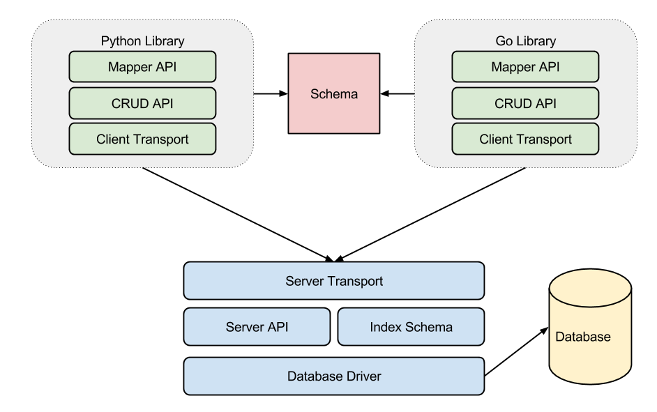

# Meduza Documentation

## What is Meduza

   Meduza is a cross-language, cross database, loose schema NoSQL data store, with an Object Mapper for easy 
   querying and code integration.

   It has a server implemented in Go, and clients currently implemented in both Go and Python. 

   The idea behind Meduza is to create a simple yet powerful data abstraction API, but in contrast to other ORMs,
   make it easy to use it across different languages. 

   To achieve this, the abstraction logic on top of the underlying databases (currently Redis)
   is implemented as a server that exposes a very high level API; And a very thin client layer just accesses this API, optionally providing
   very simple and fast mapping to model objects.

******
   
## Main design considerations

1. Complex logic resides on the server side
2. Clients are cross-lanaguage
3. Clients are as simple as possible
4. A simple and fast yet flexible wire protocol
4. The server does not enforce a schema
5. The schema is used by clients for mapping only
6. Mapping is optional
7. The server is aware of indexing metadata
    
---------------------

## Server Vs. Client
    
As stated before, the server exposes a simple CRUD API on top of underlying databases, currently only Redis, but more will be added 
in the future. 

Figure 1: Overview of high level components


The client is responsible for turning these primitive entities into objects, and verifying schema. This means that apart from indexing changes, changing a schema happens when the client is changed.

---------------------

## The Lower level - The Entity API

The API between the client and the server is defined around `Entities`, that have:

1. A "key" which is a string
2. A map of "properties", which can have any name, and a typed value of one of the supported types (see Schema section)
3. An optional TTL that is write only (we never retrieve it from the database), that can be used to set auto-expiring entities

> ## Entities

> Entities belong to  "tables", and each operation must include a table on which we operate. Although the server does not enforce schema, the tables are used for indexing specifications, and as an extra safety measure against data corruption.

> The server does not make any assumptions on the properties of the entity, and different entities can have different types to the same property in theory. However, this is not recommended, and since most of the time the  Mapper API is used and not the entity API, this property is not exposed to the user.

> #### Entity Go definition:

> ```go
    type Entity struct {
		// The id of the entity used by the primary key
    	Id         Key     
		// A map of properties that can have any internal type
    	Properties map[string]interface{}
		// optional TTL in seconds. If set to a value above 0, the entity will expire after TTL
		TTL time.Duration 
    }
```


The API is implemented using BSON, and the transport layer currently used is `RESP`, the underlying wire protocol of redis. 

See below for the full specification of the Entity API.


---------------------

## The High-level API - the Mapper API

While the Entity API can be used by any application, it is not the main intended API of Meduza. It is used by a higher level API - the Mapping API. 

The Mapping API uses the pre-defined schema to map model-objects to entities and back. The models are generated from the schema files (see below), and a lightweight library does the mapping and wraps the server calls in convenience methods. 

See the Go and Python library documentation below for detailed guides on that library.

---------------------

## Schema Definition and design

Tables, columns and indexes are defined in `Schema files` using a YAML syntax described here. Each file can describe a singel schema (databse) and all its tables. While a single schema can be split on multiple files, it is recommended to keep a single file per schema. 

The server is only interested in the `indexes` of each table in the schema, while the mapper clients are only interested in the `columns` of each table. 
This is because the server enforces no schema, and the client does not care about indexing, but rather about mapping alone.

> *NOTE: In the future the two aspects of the schema might be separated to make this point more clear.*

the baic structure of a schema file is always:

```yaml
schema: <unique schema name>
tables:
   <table name>:
      comment: <optional comment>
      primary: <primary key definition>
      options: <various options>
      class: <optional alternative class name for the mapper>
      columns: 
         <column name>:
             type: <column type name>
             comment: <optional comment>
             clientName: <optional different field name for the mapper>
             default: <optional default value>
             options:
                <type specific options>
      indexes:
         -   type: <index type (right now only "compound" is supported)>
             columns: [<column>, <column>,...]
```

### Example schema definition

```yaml
schema: foo
tables:
    # This is the table name in the database
    Packages:
        #optional comment
        comment:
            This is my packages table
        # This is the class name of the mapper's model
        class:
            Package
        
        # This is the primary key definition
        primary:
            # Compound primary indexes are based on specific property values.
            # Also available is a "Random" primary, which is just a generated unique random 64 bit id per entity
            type: compound
            columns: [packageId, locale]      
			options:
				# A compound primary key can be hashed, meaning it will run a 64-bit hashing function on its values.
				# this will cause the index to be unordered, but in case of large values where order is no concern, 
				# it is recommended
				hashed: true      
            
        # Column definitions
        columns:    
            
            packageId:
                type: Text
                # Text specific options
                options: 
                     # This column must be set when PUTting entities
                     required: true
                    
                     # the maximum length of the text field in runes
                     max_len: 100
            locale:
                type: Text

            name:
                type: Text

            rank:
                type: Int
                #this column has a default value
                default: 0
                
            currency:
                type: Text
                options:
                    # Fields can have optional sets of pre-defined valid values
                    choices: ['usd', 'nis']
                    
            screens:
                comment: "Ids of the screenshot urls copied to s3"
                clientName: screenshots
                # We support two container types - Set and List
                type: List
                options:
                    # The set's subtype is used by the mapper to transform the set's values
                    subtype: Text
            
            lmtime:
                clientName: lastModification
                type: Timestamp
                default: $now
         
        # Index definitions
        indexes:
           # this is a compound key based on one or more columns
           - type: compound
           # the field can be used to query by name AND locale, or by name only
             columns: [name, locale]
```

### Supported Column Types
These are the supported column types and their specific options:

| **Type**        | Description           | Options  |
| ------------- |:-------------|:-----|
| **Int**| 64-bit signed integer| required, choices |
| **Uint**| 64-bit unsigned integer | required, choices |
|**Float**| Double-precision float | required, choices, max_len |
|**Text**| Utf-8 encoded string | required |
|**Bool**| Boolean | required  |
|**Timestamp**| 64-bit, millisecond precision timestamp | required |
|**Binary**| Arbitrary binary blob | required, max_len |
|**Set**| A set of any type of primitive elements | required, max_len |
|**List**|A list of any type of primitive elements | required, max_len |
|Map| *not implemented yet* | |


### Defining primary keys

Each `table` in the schema has a primary key definition. A primary key defines how entity ids are generated and accessed.

The default type, that will be used if no other type is used, is `random`. It requires no further parameters.

 * Random primary keys
   
   Random primary keys generate random 64 bit, base64 encoded, id string keys for new entities. 
   If an entity is inserted via PUT and has an empty or null id, a new random id is generated and returned from the query.
  
   Entities can then be fetched based on these ids.

 * Compound primary keys

   A compound primary key generates ids based on the value of certain entity field. 

   For example, if we create a primary key based on the first and last name in a users table, the id of a user where 
   `name=John, lastName=Doe` would be generated as `john|doe|` (note that this is an implementation detail of the redis driver, do not make any assumptions in client code that ids will be generated like that).

   Optionally, compound primary keys can hash their internal values (using 64-bit FNV hashing at the moment). DO use this when order is not important (hashed primary keys cannot guarantee sorting order of objects), and when the values in the primary key are big

   This allows fetching entities not just by specific ids, but by defining normal filter sets, similar to 
    `... WHERE name IN ('john', 'hane') AND lastName='doe'`.
	


### Defining secondary indexes

Secondary indexes provide a way to select entities based on more properties than their ids or the primary index. 

* Right now the only supported secondary index is a non-unique compound index on the values of one or more **primitive** properties.

* You can define as many secondary indexes as you want, but they decrease write performance, and consume more memory in the server, so limit them
to the minimum amount required to properly query your data.

* If you create a secondary index on a number of properties, you can query by just some of them, but the selection must be based on a prefix-set of the 
entities of the index. i.e. if you create an index on `[name,lastName]`, you can use the same index to query just by `name`, but **not** by `lastName` alone. If you create an index on 3 properties, you can query based on the first one, or the first two, etc etc.

* When secondary indexes are added, future PUT/UPDATE queries will index entities according to them. A background process will do the indexing of existing entities according to the index. This means that it might take a while to query the full set of entities based on a newly created secondary index.

* Entries in a secondary index are sorted by the fields inherently, in ascending order. Sort by the last column in DESC mode to get them sorted in reverse. 

## Generating code from schema files

When a schema file changes, it needs to be deployed to the server if it contains changes to the indexes, and to the clients using these models. 
Although deployment itself is not covered here, you need to first generate code from the updated schema in your target lanaguage.

This is done via the `mdzctl` command-line utility of Meduza. 

The command for generating models for a schema is:

`mdzctl gen -f <file> -l <language> [-o <output file>]`

* File must be a valid YAML schema file. If file is set to `-` we read it from stdin.

* The language must be one of `py` or `go`. 

* If the output file is not specified, the program outputs the generated code to stdout.

## Using the Python API

The Python library for meduza can be found at https://github.com/EverythingMe/meduza-py

This is an example usage of the python API to create, get, update and delete users based on a generated model.

#### First of all, let's assume our schema is as follows:

```yaml
schema: test
tables:
    Users:
        primary:
            type: compound
            columns: [email]
        columns:
            name:
                type: Text
            email:
                type: Text
            time:
                type: Timestamp
                default: $now
            groups:
                type: Set
                options:
                    subtype: Text
        indexes:
            -   type: compound
                columns: [name,email]
```

#### Our generated model looks like this:

```py
class User(meduza.Model):

    _table = "Users"
    _schema = "pytest"

    name = Text("name", required=True)
    email = Text("email", default='')

    registrationTime = Timestamp("registrationTime", default=Timestamp.now)
    groups = Set("groups", type=Text())

    fancySuperLongNameWatWat = Text("wat")

```

#### And operating on this model looks like this:

```py

# We define a connecter function to connect to meduza
connector = meduza.customConnector('localhost', PORT)

# A separate connector for master/slave can be passed
meduza.setup(connector, connector)


# First, we create a few users

users = []
for i in xrange(10):

    u = User(name = "user %d" % i, email = "user%d@domain.com" % i,
             groups = set(("g%d" % x for x in xrange(i, i+3))),
             fancySuperLongNameWatWat = "watwat",
             )
    users.append(u)


# Now we PUT them inside meduza. We get the ids of the entities in return

ids = meduza.put(*users)


# Get is used for simple id based queries.
# The first argument is the model class, and after that we have the *ids of the objects

dbUsers = meduza.get(User, *[u.id for u in users])


# If we want to use secondary indexes or not directly use ids, 
# we use  Select and a set of filters:

dbUsers = meduza.select(User, 
                            User.name.IN('user 1', 'user 2'),  
                            User.email == 'user1@domain.com', 
                            limit=4)


# Now we can update some users.
# we provide a set of filters, and then a **kwargs style set of SET changes.
# The following changes the name of the user(s) named 'user 1' to 'Bubba':

num = meduza.update(User, User.name=='user 1', name="Bubba")


# And we now delete all the users we have created

num = meduza.delete(User, User.id.IN(*[u.id for u in users]))

```

## Using the Go API

TODO...


## The low-level Entity API commands and structures


The Entity API has the following commands, or `Queries`:

1. **PUT**

 Go definition:

  ```go
    type PutQuery struct {
    	Table    string          `bson:"table"`
    	Entities []Entity `bson:"entities"`
    }
    
    type PutResponse struct {
     *Response
    	 Ids []Key `bson:"ids"`
    }
```
    
 PUT is a batch insert/update query. It accepts the table/schema name we're inserting into, and a list of entities to be inserted or repalaced.

 If the entities already contain Id keys, these ids are respected by the engine, and this can be considered an UPDATE query that inserts entities
 if they do not already exists. 
  
 If empty ids are sent, the engine generates ids for the entities, inserts them as new entities, and returns the ids of the new entities. 

 The response returns the list of ids, whether newly generated or existing, to the given entities, in order. 

2. **GET**

 Go definition:

 ```go
    type GetQuery struct {
        	Table      string   `bson:"table"`
        	Properties []string `bson:"properties"`
        	Filters    map[string]Filter  `bson:"filters"`
        	Order      Ordering `bson:"order"`
        	Paging     Paging   `bson:"paging"`
    }
    
    type GetResponse struct {
        	*Response
        	Entities []schema.Entity `bson:"entities"`
        	// the total number of entities matching this response
        	Total int `bson:"total"`
    }
```

  GET fetches a set of entites based on selection filters, be them specific ids or parameters passed to secondary indexes. It is limited
  by a `Paging` object containing offset and number of elements to fetch, and optionally ordered by a field in ascending or descending order. 
  Note that filtering and ordering are only applicable for indexed fields.
  
  > ### Filters

  > a `Filter` is defined as a tuple of `[property, operator, value(s)]`, e.g. `['name', '=', 'John']`. The property must be indexed either by the primary or a secondary index. Multiple values are allowed for `IN` and `BETWEEN` operators. 

  > The **currently** allowed operators are: `EQ` (equality), `IN` (the property's value is one for N possible values), `BETWEEN` (the property's value is between MIN and MAX); and `ALL` - meaning no filtering at all, used for paging over all the objects of a certain table in primary id order.
 

3. **UPDATE**

 Go definition:

 ```go
    type UpdateQuery struct {
            	Table   string   `bson:"table"`
            	Filters map[string]Filter  `bson:"filters"`
            	Changes []Change `bson:"changes"`
     }

    type Change struct {
        	Property string      `bson:"property"`
        	Value    interface{} `bson:"value"`
        	Op       ChangeOp    `bson:"op"`
    }
    
    type UpdateResponse struct {
        	*Response
        	Num int `bson:"num"`
    }
```

 UPDATE applies a set of `Changes` on entities matching a set of filters. The same rules for filters apply as in a GET query.

 A change is defined as an `OP` performed on a property. Currently the only supported ops are:
 * `SET` which replaces the value of the entity
 * `INCR` which increments an integer or float value
 * `EXP` which sets the entities matching the filter to expire. (this op doesn't need a property since it expires the entire entity)

 More ops such add-to-set, boolean ops, multiply, etc will come further down the road as needed. Example change: `('name', 'SET', 'Vova')`.

 The response contains the number of entities updated.

4. **DEL**

 Go defintion:

 ```go
    type DelQuery struct {
        	Table   string  `bson:"table"`
        	Filters map[string]Filter `bson:"filters"`
    }
    
    type DelResponse struct {
        	*Response
        	Num int `bson:"num"`
    }
```

 DEL deletes the entities matching the selection in `Filters` (see the Filters section in GET). It returns the number entities deleted.

5. **PING**

 PING is a special query not actually handled by the database, but returns a PONG response. It is used by the client libraries to ensure servers are alive.


## Technical notes and future tasks

TODO...
